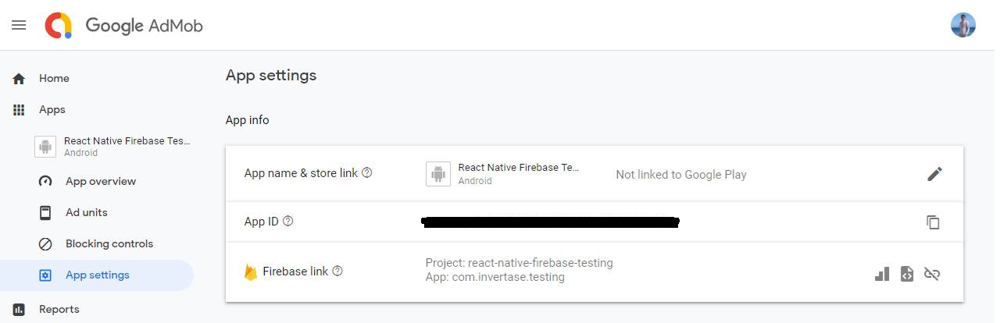

# 安裝

```bash
# Install the admob module and config plugin
npx expo install react-native-google-mobile-ads
```

## 設定 Google AdMob

在加入廣告前，需要先取得 [Google AdMob](<https://admob.google.com/signup?sac=true>) 帳號

:::warning
如果build app時沒有設定AppId的話會導致錯誤
:::

在 App settings 建立應用並找到 App ID



## Expo 專案配置設定

在 Expo 專案 中啟用 iOS 靜態框架（Static Frameworks）的設定
- 啟用靜態框架有助於解決一些與第三方原生套件的衝突，並提高構建時的穩定性。
```json
// <project-root>/app.json
{
  "expo": {
    "plugins": [
      [
        "expo-build-properties",
        {
          "ios": {
            "useFrameworks": "static"
          }
        }
      ]
    ]
  }
}
```

務必將下列程式加入Expo專案配置（如 `app.json`、`app.config.js` 或 `app.config.ts`）
記得Rebuild app 使這些變更生效

```js
// <project-root>/app.json
{
  "expo": {
    "plugins": [
      [
        "react-native-google-mobile-ads",
        {
          "androidAppId": "ca-app-pub-xxxxxxxx~xxxxxxxx", // 這是你的App id
          "iosAppId": "ca-app-pub-xxxxxxxx~xxxxxxxx" // 這是你的App id
        }
      ]
    ]
  }
}
```

如果你的Expo App`沒使用`了EAS，請使用下列指令
```bash
# For iOS
npx expo prebuild
npx expo run:ios

# For Android
npx expo prebuild
npx expo run:android
```

如果你的Expo App`使用`了EAS，請使用下列指令
```bash
# For online builds
npx eas-cli build --profile development

# For local builds
npx eas-cli build --profile development --local
```

# Google 官方教學 : [點我前往](<https://docs.page/invertase/react-native-google-mobile-ads>)