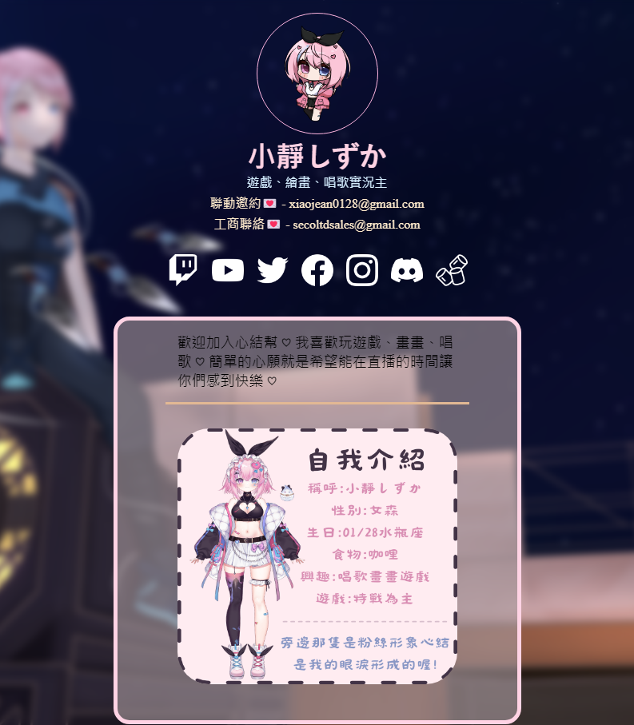

# 生活紀錄
最近一直在思考未來的事情，我大學念機械系並在2023年6月畢業，但諷刺的是畢業後卻對機械沒什麼興趣，到處打轉試了一些工作後，發現自己對要求體力的工作特別不行，最深刻的一次是一份需要久站的工作，它讓我知道自己久站的極限大約兩小時，也是從這時候我開始萌生學習寫程式的想法。

以前念機械系也有碰到些許的程式，但主要是寫計算類的協助分析力學，大部分時候都是模仿著老師寫，沒有太多程式觀念的教學，雖然有寫出來但根本不了解怎麼運作成功的。畢業後的第五個月差不多是11月的時候，我存了一筆錢換了比較新的電腦，打算靠它開始自學寫程式這件事，11月主要在思考跟了解要怎麼開始學程式，12月決定從寫網頁開始學起，因為程式的領域很廣，有寫手機app、網頁、遊戲等等很多的領域，網頁相對其他領域來說比較直觀且容易理解，因為寫出來的東西是能馬上看見解果來做調整的，因為月底即將去服役，所以我花兩個星期認識了基本的html,css後，變在12/20開始在本機上嘗試寫第一個網頁，模仿一個比較喜歡的介面並做了點個人化的設計(如下)，網站的主角是一個做實況的朋友，現在已經經歷了不少改變，有興趣的可以去看看。

**網址** : <a href='https://xiaojean0128.com' target='_blank' style='color:#ffd3e4; text-decoration: none;'  rel="noreferrer">xiaojean0128.com</a>

